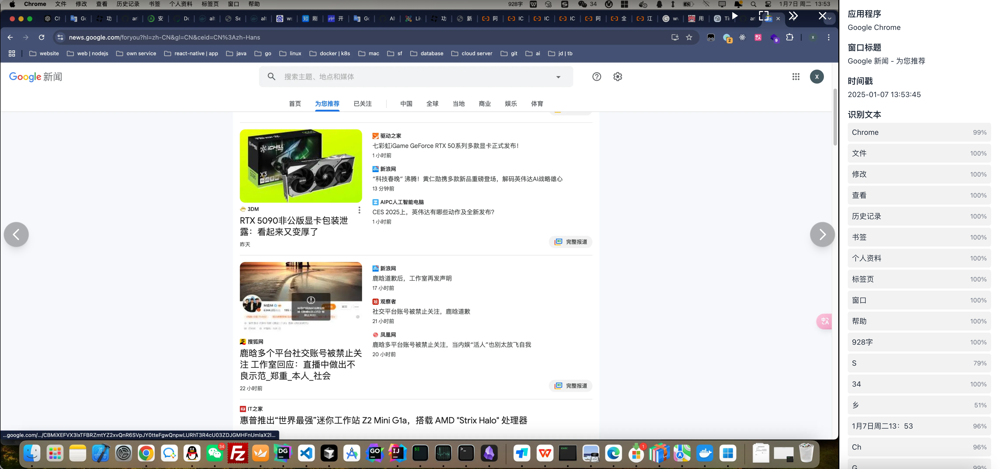

# Timebox

> 让每个屏幕瞬间都成为触手可及的记忆  

Timebox 是一款开源的屏幕记录与检索工具，分为客户端和服务端。客户端按固定时间频率自动截取屏幕并将截图上传至服务端，服务端对截图进行存储和 OCR（文字识别）处理，支持基于时间范围和文字内容的快速检索。通过 Timebox，用户可以轻松回溯并快速找到过往的记录，构建一个属于自己的“屏幕瞬间搜索引擎”。




---

## 功能特色

- 🖥️ **全屏幕截图**：客户端定时截取屏幕，自动上传至服务端。
- 🔍 **文字检索**：通过 OCR 识别截图中的文字，并存储到 PostgreSQL 数据库中，支持文字内容检索。
- 📅 **时间筛选**：支持按时间范围筛选截图，快速定位目标记录。
- 🌐 **服务端网页检索**：提供直观的 Web 界面，方便用户检索和查看截图。
- 💾 **数据持久化存储**：服务端对截图和 OCR 数据进行持久化管理，支持长时间的历史记录回溯。
- 🚀 **开源与可扩展**：完全开源，支持个性化部署与功能扩展。

---

## 项目灵感与区别

Timebox 的灵感来源于以下项目：

- [Pensieve](https://github.com/arkohut/pensieve)  

两者存在以下关键区别：

| 功能            | Pensieve                  | Timebox                        |
|-----------------|--------------------------|--------------------------------|
| 数据存储方式     | 本地存储                  | 服务端集中存储，支持多客户端  |
| OCR 处理         | 客户端完成(可服务端)      | 服务端统一处理(可集群)                |
| 检索方式         | 本地检索                  | 服务端提供网页检索功能        |
| 架构设计         | 可客户端独立运行            | 客户端与服务端分离                |

Timebox 提供了更强大的服务端支持，适合需要集中管理和检索大规模截图数据的场景。

---

## 安装指南  

### 客户端安装  

Timebox 客户端支持 **macOS** 和 **Windows** 平台，您可以按照以下步骤进行安装：  

1. 前往 [Timebox Release 页面](https://github.com/Alt-er/timebox/releases) 下载适合您系统的客户端安装包：  
   - macOS 用户请下载后缀为 `.dmg` 的文件。  
   - Windows 用户请下载后缀为 `.exe` 的文件。  
2. 按照平台指引安装：  
   - macOS：双击 `.dmg` 文件并将 Timebox 拖拽至应用程序文件夹。  
   - Windows：双击 `.exe` 文件并按照安装向导完成安装。  
3. 安装完成后，启动客户端并查看系统托盘(windows)或者菜单栏(macOS)是否有 Timebox 图标，如果有，则表示安装成功。
4. 启动客户端后，点击设置进行服务端配置(需要先配置好服务端)。
5. 配置完成后，点击`开始记录`按钮，客户端会开始自动截取屏幕并上传至服务端。


### 服务端部署  

Timebox 服务端支持 **Linux**、**macOS** 和 **Windows** 平台，您可以选择以下两种方式之一进行部署：  

> OCR 服务支持以下运行模式：

| 编号 | 部署方式 | 操作系统 | CPU 模式 | GPU 模式 | 备注 |
|-----|---------|---------|----------|-----------|------|
| 1 | Docker | Linux   | ✓ 支持   | ✓ 支持 CUDA | 需要 NVIDIA 显卡和驱动，可通过 nvidia-smi 命令检查 |
| 2 | Docker | Windows | ✓ 支持   | ✓ 支持 CUDA | 需使用 WSL2 + Docker，支持 NVIDIA 显卡 |
| 3 | 手动部署 | Windows | ✓ 支持   | ✓ 支持 DirectML | 支持多种显卡，包括 NVIDIA、AMD、Intel |
| 4 | 手动部署 | macOS   | ✓ 支持   | ✓ 支持 MPS | 支持 Apple Silicon 和 Intel 芯片，自动启用 GPU 加速 |
| 5 | 手动部署 | Linux   | ✓ 支持   | ✓ 支持 CUDA | 需要 NVIDIA 显卡和驱动 |

#### 方式 1：使用 Docker 部署

> windows系统请进入wsl环境后执行, 需要安装wsl2和docker desktop

##### 1. 创建并进入项目目录
```bash
mkdir timebox
cd timebox
```

##### 2. 下载配置文件
```bash
# 下载环境配置文件
curl https://raw.githubusercontent.com/Alt-er/timebox/main/.env.example -o .env
# 下载docker-compose配置文件
curl https://raw.githubusercontent.com/Alt-er/timebox/main/docker-compose.yml -o docker-compose.yml
```

##### 3. 配置与启动
```bash
# 编辑环境配置文件
vi .env

# 在编辑环境配置文件时，需要根据实际情况修改以下配置项：

# TZ: 时区设置，默认为 Asia/Shanghai

# 数据库相关配置
# POSTGRES_USER: PostgreSQL数据库用户名
# POSTGRES_PASSWORD: PostgreSQL数据库密码
# POSTGRES_DB: PostgreSQL数据库名称
# POSTGRES_PORT: PostgreSQL数据库端口号，默认5432

# 网页管理相关配置
# SECRET_KEY: session加密使用的key，建议使用随机字符串，务必修改默认值
# DEFAULT_USERNAME: 设置默认管理员用户名，用于登录服务端网页
# DEFAULT_PASSWORD: 设置默认管理员密码，用于登录服务端网页

# OCR服务配置
# OCR_CONCURRENT_LIMIT: 最大并发OCR任务数，根据服务器性能调整
# OCR_SERVICE_URLS: OCR服务地址，多个地址用逗号分隔
# OCR_API_TOKEN: OCR服务认证令牌，确保core-service和ocr-service中的值一致
# USE_CUDA: 是否启用CUDA GPU加速（需要NVIDIA显卡），注释不启用, 设置为true启用
# USE_DML: 是否启用DirectML GPU加速（仅Windows系统支持），true/false，默认false
# OCR_NUM_WORKERS: OCR服务工作进程数
# OCR_SERVICE_TOKENS: OCR服务认证令牌列表，多个令牌用逗号分隔，必须与core-service中的OCR_API_TOKEN匹配

# 示例配置文件内容：

# 部署方式1 和 部署方式2的配置是一样的, 区别是windows环境需要提前装好wsl2和docker desktop, 然后在wsl环境中执行docker命令, 本质上都是linux
SECRET_KEY=11111111111111
DEFAULT_USERNAME=admin
DEFAULT_PASSWORD=admin
USE_CUDA=true   # 如果有cuda加速, 请设置为true, 否则不要这一行, 不能设置为false

# 启动服务
docker compose up -d
```
##### 4. 访问服务
访问`http://{服务端IP}:8000/timebox`即可访问服务端网页。请在客户端中配置`http://{服务端IP}:8000`这个地址。

#### 方式 2：手动部署

> 注意：手动部署方式支持 CPU 和 GPU 模式运行 OCR 服务。
> 
> macOS 系统会自动使用 GPU 加速无需额外配置，Windows 系统需要手动配置 DML 模式才能使用 GPU。
> 
> 可在 macOS 或 Windows 系统上手动部署 OCR 服务。其余服务使用 Docker 部署。

##### 1. 安装 Miniconda 与 PostgreSQL
- 访问 [Miniconda官方文档](https://docs.anaconda.com/miniconda/install/#quick-command-line-install) 获取安装指南
- 访问 [PostgreSQL 16/17 下载页面](https://www.postgresql.org/download/) 安装 PostgreSQL 16 或 17 版本

##### 2. 克隆项目
```bash
git clone https://github.com/Alt-er/timebox
cd timebox
```

##### 3. OCR服务配置
```bash
# 创建并激活虚拟环境
conda create -n ocr-service python=3.12
conda activate ocr-service

# 进入ocr-service目录
cd timebox/server/ocr-service

# 安装依赖
pip install -r requirements.txt
# 安装依赖 使用清华源安装
pip install -r requirements.txt -i https://pypi.tuna.tsinghua.edu.cn/simple

```

##### OpenVINO CPU 模式运行(可选，仅支持Intel CPU)
```bash
# Intel CPU 
pip install rapidocr-openvino 
# Intel CPU 使用清华源安装
pip install rapidocr-openvino -i https://pypi.tuna.tsinghua.edu.cn/simple

```

###### DirectML GPU 模式运行(可选，仅支持Windows)
```bash
# 创建环境配置文件
echo USE_DML=true > .env

# 切换到DirectML后端
pip uninstall onnxruntime
pip install onnxruntime-directml
# 使用清华源安装
pip install onnxruntime-directml -i https://pypi.tuna.tsinghua.edu.cn/simple

```
###### 修改配置
```bash
# 创建.env文件
cp .env.example .env

# 编辑.env文件
vi .env
```

###### 运行OCR服务
```bash
python run.py
```

##### 4. Core服务配置
```bash
conda create -n core-service python=3.12
conda activate core-service

# 进入core-service目录
cd timebox/server/core-service

# 安装依赖
pip install -r requirements.txt
# 安装依赖 使用清华源安装
pip install -r requirements.txt -i https://pypi.tuna.tsinghua.edu.cn/simple
```
###### 修改配置
```bash
# 创建.env文件
cp .env.example .env

# 编辑.env文件
vi .env
```

###### 运行Core服务
```bash
python run.py
```

##### 5. 访问服务
访问`http://{服务端IP}:8000/timebox`即可访问服务端网页。请在客户端中配置`http://{服务端IP}:8000`这个地址。


#### Conda 常用命令
```bash
# 虚拟环境是用来隔离不同项目的 Python 环境，避免依赖冲突。

# 退出当前虚拟环境
conda deactivate

# 激活指定虚拟环境
conda activate ocr-service

# 查看所有虚拟环境
conda env list

# 删除指定虚拟环境
conda env remove -n ocr-service
```


